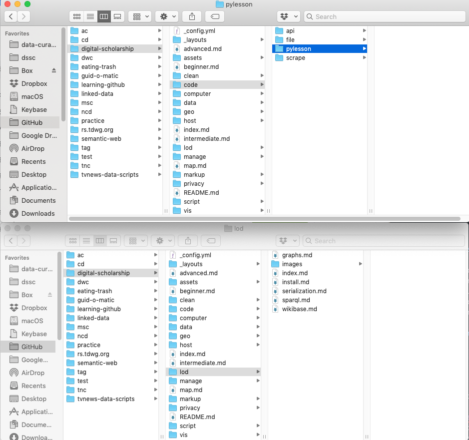

## Workshop II: GitHub for Intermediate Users

# The Plan

1. Working with the GitHub Desktop Client
   * Cloning a repo
   * Branches, Commits, and Pull Requests
   * Working with a forked repository
2. Resolving merge conflicts

## Working with a Forked Repository

Building your own repository can be fun, but sometimes you just want to contribute to an existing project or maybe you'd like to use someone else's project as the starting point for a new project of your own. If that's the case it's time to **Fork**.

Creating a **fork** creates a personal copy of someone else's project. You can submit Pull Requests to help make other people's projects better by offering your changes up to the original project. We're going to create a fork of the **Learning-GitHub** repository created by **HeardLibrary**.

* Navigate to the page for the **Learning-GitHub** repository, and click the **Fork** button in the header of the repository. This will create an exact duplicate of HeardLibrary's Learning-GitHub repository under your own GitHub username.

We've been able to make edits to our files in the web version of GitHub, but that can get tricky.  Installing the GitHub desktop client gives us more flexibility in how we can interact with the documents and files within our repository.

Download GitHub Desktop (available for MAC and PC), and login to your GitHub account in the desktop client.  [https://desktop.github.com/](https://desktop.github.com/)

Now that you've successfully installed GitHub Desktop and forked the Learning-GitHub repository, it's time to get to work.  Currently your fork of the Learning-GitHub repository only exists in the GitHub web client, but we need to clone it to your computer.

* Navigate to your fork of the Learning-GitHub repository.  Click on the green **Clone or download** button on the right side of the screen and click open in desktop.

* Once you've successfully cloned the repository, all the repository files will be available to you on your desktop.  

## Cloning a repository using the desktop client

In addition to cloning a repository from the website side, you can also clone from your local computer using the GitHub desktop client.  The process described here will work for cloning one of your own repositories, a repository that you've forked to your account from elsewhere, or another repository that you don't own, but to which you have been given write access.

Drop down the Current Repository menu in the upper left of the window.  Click on the Add dropdown and select "Clone Repository...".

You'll be presented with a list of repositories at Github.com to which you have access.  Repos that you own or to which you have write access will show up with little book icons.  Repos that are clones of some other repo will have a little "fork" symbol.  Click on the name of the repo you want to clone and you'll have an opportunity to select where you want the local copy of the repo to live on your computer.  Once you've selected a location, the desktop client will default to that location the next time you clone.

## Working with cloned files

After you've finished the cloning process, in the left column of the client, you'll see either changed files or the commit history, depending on which tab you've selected.  

By dropping down the Current Repository list, you can switch to a different cloned repository, including one that you cloned from the GitHub website side. By default, the desktop client chooses the master branch of a newly cloned repo.  However, you can change from the master branch to another existing branch by dropping down the middle "Current Branch" menu at the top of the window.  

When you select a default branch in this dialog, we say that your are "checking out" that branch. Checking out a branch literally changes the files that are present on your local computer. For example, when I selected the master branch as my current branch, here's what several directories looked like:

You can see that the pylesson directory has a lot of files in it and the lod directory doesn't.  If I change to the "gh-pages" branch:

I'm checking out a different set of files.  Here's what the directories look like now:

Some files have disappeared, like the ones in the pylesson directory, and other files have appeared in the lod directory.  The content of the files themselves may also change.  So it's important before you start working on files that you are clear what branch you currently have checked out.  

## Work cycle

When you are editing files using GitHub desktop, it is important to have a disciplined work cycle. It's very important to make sure at the start that the branch you are working on has the most recent version checked out. Click on the Fetch origin button at the upper right of the window.  If there are changes that need to be downloaded, you'll see a small number by a downward pointing arrow.  Click the button (now labeled "Pull origin") again to download those changes.

If you forget to update your local copy of the branch, you risk creating a conflict, since you will be working on a copy that isn't the most recent one.

Let's open a text editor (Use Notepad today, but I recommend installing ATOM, [https://atom.io/](https://atom.io/), for your personal use).  Navigate to the location where you checked out the repo.  Make some changes to the _**TakeAways.md**_ file, then save it.  If you click on the Changes tab at the upper left of the window, you should see the files that changed since the last update and clicking on a file in the middle pane will show the kind of changes at the right of the screen.  

  * Remember to create a working branch first!
  * Commit your changes and then click on the **Sync** button to push your changes from the desktop client to GitHub.com.

* Now it's time to propose changes into the main project.
  * Go to your fork of the repository on GitHub.com and click on the green **Compare & pull request** button or use the pull request tab to create your pull request.

Once the pull request is submitted, it is up to the project owner whether your changes will be pulled into the repository or not.

### For more tutorials and resources about using GitHub visit:
**GitHub Guides** [https://guides.github.com/](https://guides.github.com/)
**GitHub Training & Guides** [https://www.youtube.com/user/GitHubGuides/featured](https://www.youtube.com/user/GitHubGuides/featured)
**GitHub Help** [https://help.github.com/](https://help.github.com/)
